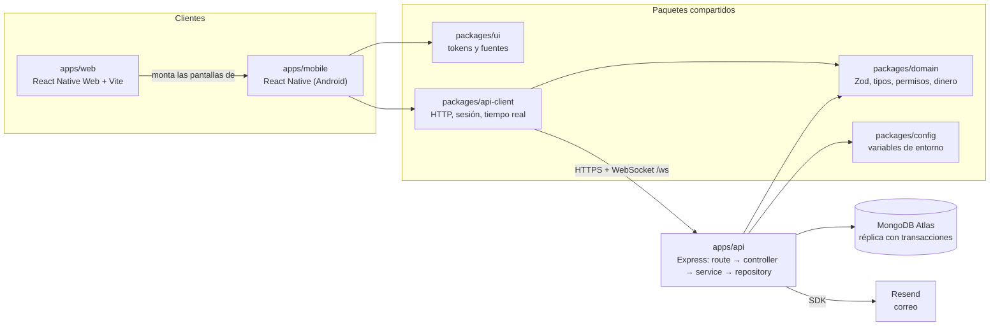

# Guía de estudio: ERP de obras de T-ssera Construcciones

Para exponer el proyecto en su estado real. Cada concepto cita dónde verlo en el código. Lo que no está hecho se dice.

## 1. Qué es

- Un ERP multi-empresa para una constructora sustentable: propuestas, obras, presupuesto ejercido, certificaciones
  (LEED, EDGE) e impacto ambiental, en una app Android y una web que comparten el mismo código.
- **Propósito de la marca:** construir espacios que crecen con el entorno, no a costa de él.
- **Propuesta de valor:** construcción con estándares de sustentabilidad verificables, sin sobrecosto ni sobreplazo
  frente a una obra convencional. El sistema aporta la parte "verificable": cada cambio queda con folio, autor y fecha.

## 2. Arquitectura

La web no tiene pantallas propias: `apps/web/src/main.tsx` monta `apps/mobile/App.tsx`. Lo que cambia por plataforma
está en archivos `.web.ts(x)` (ver ADR 0006).

## 3. Recorrido de una petición: aprobar una propuesta

`POST /construction/proposals/:id/approve`

| Paso | Qué pasa | Dónde |
|---|---|---|
| 1. Autenticación | Verifica la firma del JWT y, contra la base, que la sesión siga abierta y la cuenta activa. El rol sale de la base, no del token | `core/middlewares/auth.ts`, `modules/identity/access.ts` |
| 2. Tenant | Toma el `tenantId` del token; el cliente nunca lo envía | `core/middlewares/tenant.ts` |
| 3. Permiso | `requirePermission('construction.proposals:approve')`; sin él, 403 | `proposals/proposals.routes.ts:18`, `core/middlewares/permissions.ts` |
| 4. Validación | Zod valida el `id` de la ruta (esta acción no lleva cuerpo). Un error sale como `VALIDATION_ERROR` | `proposals.controller.ts:43`, `core/error-handler.ts` |
| 5. Controller | Solo traduce HTTP: llama al service y arma la respuesta | `proposals.controller.ts` |
| 6. Service | Regla de negocio: solo se aprueba lo que está `in_review`; si no, 409 `INVALID_TRANSITION` | `proposals.service.ts:227` |
| 7. Transacción | Una sola, con reintento: cambia la propuesta, crea la obra en `planning`, crea el movimiento `initial_budget` y escribe la bitácora. Si algo falla, no queda nada a medias | `config/database.ts` (`withTransaction`) |
| 8. Folios | `OBR-000001` y `MOV-000001` con `findOneAndUpdate` + `$inc` + `upsert`, dentro de la transacción: si aborta, no hay huecos | `core/counters.ts` |
| 9. Bitácora | Tres entradas inmutables en `auditLog`, sin montos | `core/audit.ts` |
| 10. Repository | El único que toca MongoDB, siempre con `tenantId`. El estado `in_review` va en el filtro de la escritura | `proposals.repository.ts`, `core/repository.ts` |
| 11. Respuesta | Con o sin montos según `construction.budget:read_amounts`. Se avisa por WebSocket, sin datos | `proposals.service.ts`, `core/realtime.ts` |

Todas las rutas son relativas a `apps/api/src` y, las de propuestas, a `modules/construction/proposals/`.

## 4. Decisiones técnicas y por qué

- **Multi-tenant por `tenantId`:** un solo clúster; `TenantRepository` no deja consultar sin tenant (`core/repository.ts`).
  Excepción documentada: login, refresh y tokens de un solo uso buscan por un campo único global, en métodos que
  terminan en `AcrossTenants` (`modules/identity/identity.repository.ts`, ADR 0003).
- **`Decimal128`:** el dinero nunca pasa por `Number`, que redondea. En JSON es un string con dos decimales
  (`packages/domain/src/construction.ts`, `core/decimal.ts`).
- **Presupuesto derivado de movimientos inmutables:** la obra no guarda saldos; se suman con agregaciones de MongoDB.
  Corregir es registrar el movimiento contrario (`modules/construction/budget/`).
- **Borrado lógico y bitácora:** `deletedAt` permite restaurar desde la Papelera; `auditLog` solo inserta y consulta
  (`modules/construction/trash/`, `core/audit.ts`).
- **Permisos por módulo y acción:** el mapa rol → permisos vive en `packages/domain/src/permissions.ts`; la API lo
  exige por ruta y el cliente usa `can()`. **Los montos se ocultan en la API**, no en la interfaz (ADR 0004).
- **Validaciones compartidas:** los mismos esquemas Zod validan en el formulario y en la API (`packages/domain`).
- **React Native con React Native Web:** un solo juego de pantallas para Android y navegador (ADR 0006).
- **Resend:** correo por API HTTPS, detrás de la interfaz `EmailSender` para poder simularlo o cambiarlo
  (`platform/integrations/email/`).

## 5. Seguridad

- **JWT corto con refresh rotado:** access token de 15 minutos; el refresh es opaco, se guarda solo su hash y se
  cambia en cada uso. Reusar uno ya rotado cierra todas las sesiones (`identity.service.ts`).
- **Web:** el refresh token vive en una cookie `httpOnly`; JavaScript no lo ve (`identity/session-cookie.ts`).
- **Contraseñas:** se usa **`scrypt` de Node, no argon2id** (`identity/password.ts`). Se eligió para no depender de un
  módulo nativo; migrar a argon2id está pendiente. Política: de 15 a 128 caracteres.
- **Mensajes genéricos:** correo inexistente, contraseña incorrecta y cuenta inactiva responden igual; "olvidé mi
  contraseña" siempre responde lo mismo. Bloqueo tras 5 fallos y límite por IP.
- **Secretos:** solo en variables de entorno, validadas al arrancar (`packages/config`). Nada en el repo.
- **Correos:** todo valor de usuario se escapa en el layout y los enlaces salen solo de `APP_WEB_URL`.

## 6. Pruebas

- Jest + Supertest sobre una réplica de MongoDB en memoria, así las transacciones se prueban de verdad.
- **Última ejecución: 17 suites, 244 pruebas, todas pasan.**
- Cubren: acceso y sesiones (incluida la cookie), usuarios e invitaciones, propuestas, obras, presupuesto,
  certificaciones, papelera, aislamiento entre tenants, permisos y montos, catálogos, inventario, plantillas de correo
  y configuración.
- **No hay pruebas automáticas de la app ni de la web.** La web se comprobó a mano y con Chrome sin interfaz.

## 7. Estado actual

| Hecho | Pendiente | Limitaciones conocidas |
|---|---|---|
| Acceso completo: login, recuperación, invitaciones, perfil | Registrar gastos por API (hoy los carga el seed) | En producción la cookie de sesión es de terceros: algunos navegadores no la conservan |
| Propuestas, obras, presupuesto, certificaciones, papelera | Evidencias de certificación (archivos) | Dos pestañas renovando la sesión a la vez pueden cerrarla |
| Roles `admin` y `user` con montos ocultos desde la API | `GET /users/:id` y notificaciones | La web usa el diseño de teléfono, sin vista de escritorio |
| App Android y web con las mismas pantallas | Migrar contraseñas a argon2id | `onboarding@resend.dev` solo entrega al dueño de la cuenta de Resend |
| Correos con la marca y logo embebido | Cerrar el WebSocket al desactivar una cuenta | El APK lleva fija la URL de la API con la que se compiló |
| APK de release firmado | Módulos de ventas, compras, finanzas y RH | BullMQ y Redis están preparados, sin uso |

## 8. Guion de demostración (5 minutos)

1. **Admin, web (1 min):** inicia sesión. Dashboard con "Requiere tu atención" y KPIs.
2. **Admin (1 min):** Propuestas → abre una en revisión → Aprobar. Se crea la obra `OBR-…`; muéstrala en Obras con su
   presupuesto inicial.
3. **Admin (1 min):** en la obra, registra un ajuste de presupuesto y abre la actividad: quién, qué y cuándo.
4. **User, celular (1 min):** misma obra, sin montos, solo porcentajes, y sin botones de administración. Si quedó
   abierta, el cambio del paso 2 aparece sin recargar.
5. **Admin (1 min):** Perfil → Usuarios → Invitar. Muestra el correo con la marca y, si da tiempo, la Papelera.

## 9. Preguntas probables

1. **¿Por qué MongoDB para algo contable?** Lo fija el stack del proyecto. Se compensa con disciplina: `Decimal128`,
   movimientos inmutables, saldos derivados y transacciones en lo crítico.
2. **¿Qué pasa si dos personas aprueban la misma propuesta a la vez?** El estado `in_review` va en el filtro de la
   escritura, dentro de una transacción. Solo una gana; la otra recibe 409 `INVALID_TRANSITION` y no se crea otra obra.
3. **¿Cómo se evita que una empresa vea datos de otra?** El `tenantId` sale del token, nunca del cliente, y el
   repository base lo agrega a toda consulta. Hay pruebas de aislamiento por módulo.
4. **¿Por qué no se pueden editar los movimientos?** Porque un saldo debe poder explicarse. Se corrige con un
   movimiento contrario enlazado, y solo una vez.
5. **¿Y si alguien oculta los montos solo en la pantalla?** No basta: la API no los envía a quien no tiene el permiso.
   Las pruebas revisan el JSON real.
6. **¿Qué pasa si roban un refresh token?** Al usarlo, el legítimo queda rotado; en cuanto el dueño lo usa, la API
   detecta el reuso y cierra todas las sesiones.
7. **¿Cómo comparten código la app y la web?** La web monta las mismas pantallas con React Native Web; solo cambian
   cuatro piezas con versión `.web`.
8. **¿Por qué los folios no tienen huecos?** El contador se incrementa dentro de la misma transacción que crea el
   documento: si falla, el incremento se revierte.
9. **¿Usan argon2id?** No. Hoy es `scrypt`, que también es resistente a fuerza bruta; argon2id queda pendiente.
10. **¿Qué falta para producción?** Un dominio común para web y API, dominio verificado en Resend, registrar gastos
    por API y pruebas automáticas de la interfaz.
